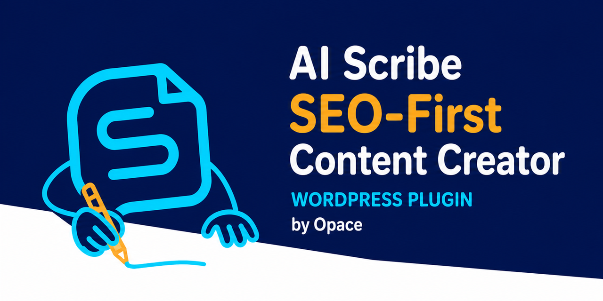
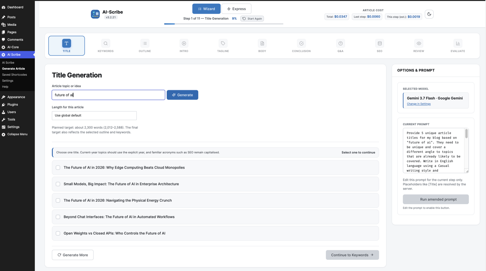
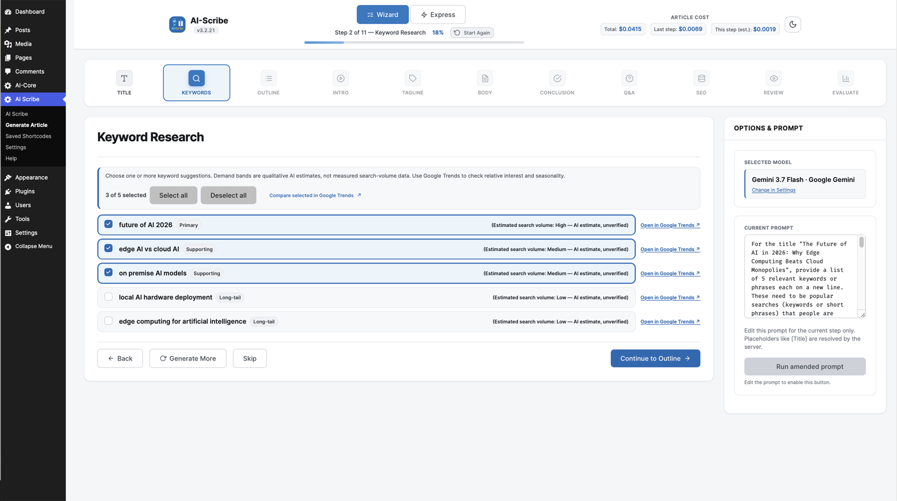
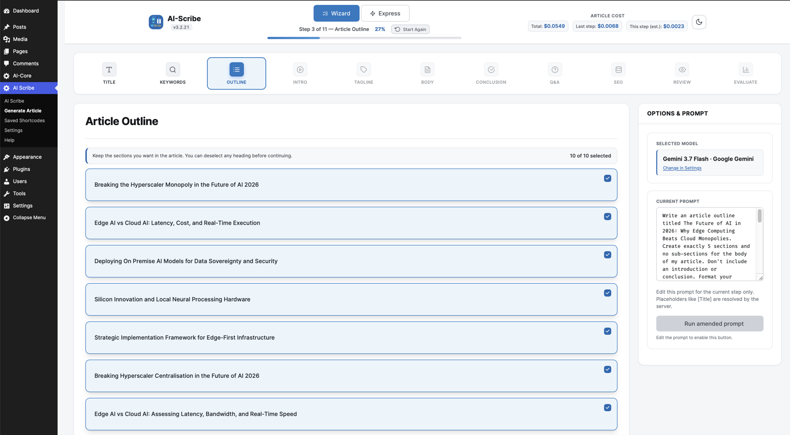
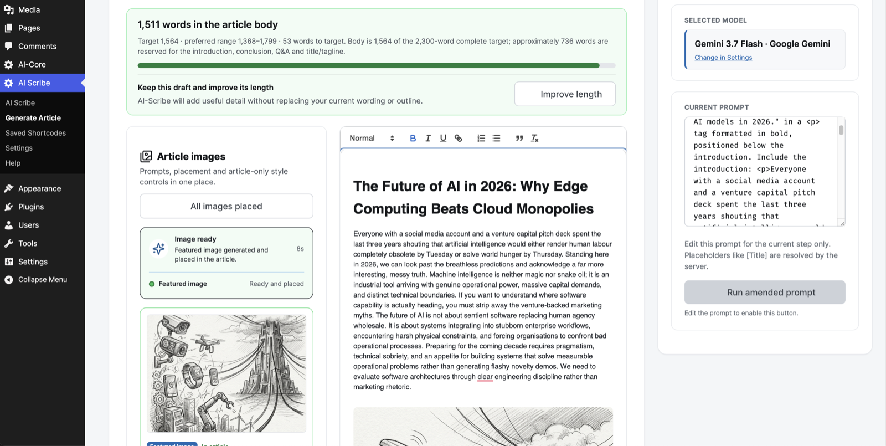
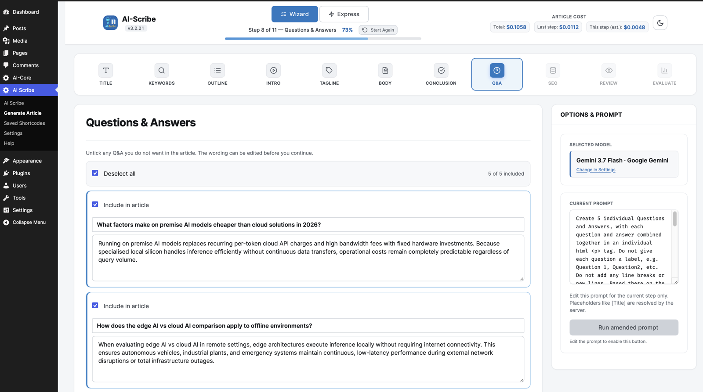
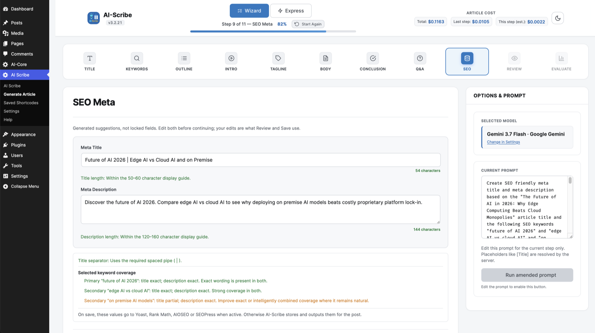
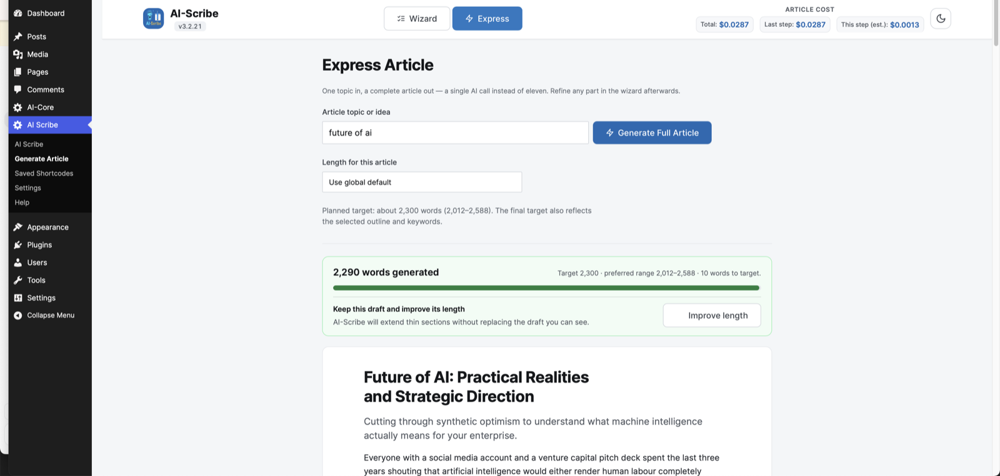
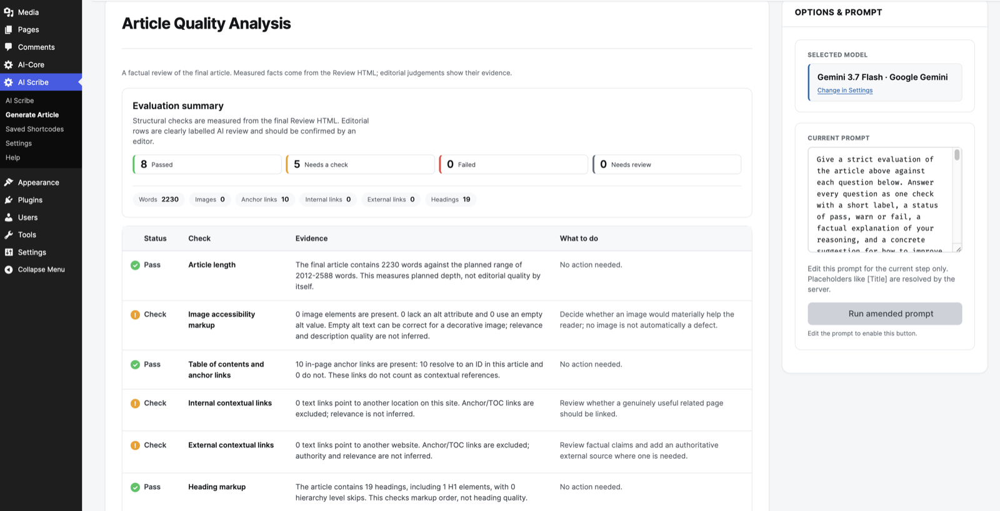

# AI Scribe

<p align="center">
  
</p>

<p align="center"><strong>SEO content creator and humaniser for WordPress, powered by OpenAI, Anthropic and Google Gemini.</strong></p>

<p align="center">
  
  
  
  
  
</p>

<p align="center">
  <a href="https://wordpress.org/plugins/ai-scribe-the-chatgpt-powered-seo-content-creation-wizard/">WordPress.org</a>
  · <a href="https://github.com/OpaceDigitalAgency/ai-scribe-chat-gpt-content-creator/issues">Issues</a>
  · <a href="SECURITY.md">Security</a>
  · <a href="https://github.com/OpaceDigitalAgency">More from Opace</a>
</p>

AI Scribe requires the separate [**Opace AI Hub**](https://github.com/OpaceDigitalAgency/opace-ai-prompt-library-api-hub-wordpress-plugin) plugin. Opace AI Hub centralises encrypted provider keys,
live model discovery, shared prompts, usage and cost reporting. Install it from
[WordPress.org](https://wordpress.org/plugins/opace-ai-prompt-library-api-hub/) or review its
[public source on GitHub](https://github.com/OpaceDigitalAgency/opace-ai-prompt-library-api-hub-wordpress-plugin).

AI Scribe is independently developed by Opace Digital Agency and is not affiliated with, endorsed by or sponsored by OpenAI, Anthropic or Google.

**Compatibility:** requires WordPress 6.5 or newer and has been tested up to **WordPress 7.1**.

AI Scribe is a free, open-source SEO AI writer, content generator and humaniser. It writes long-form,
search-optimised articles inside WordPress. An eleven-step wizard takes an
idea through titles, keywords, outline, body, conclusion, Q&A and SEO meta; Express mode starts with one
structured whole-article generation. Optional length improvements are separate requests. Output goes to a draft, a published post, or a saved shortcode you can drop into
any page builder.

## What AI Scribe does

- Guides an article through titles, keywords, outline, introduction, tagline, body, conclusion, Q&A,
  SEO metadata, Review and Evaluate, or creates a complete first draft in Express mode.
- Keeps the whole article in one conversation so later sections retain earlier context.
- Discovers compatible writing and image models from your OpenAI, Anthropic or Gemini account.
- Makes prompts and results editable, with saved AI Scribe prompts and shared Hub prompts.
- Applies language, style, tone, spelling, writing mode and reusable Custom Instructions.
- Measures article length and preserves a usable draft if a later improvement fails.
- Labels keyword demand as an unverified AI estimate and links to Google Trends for comparison.
- Generates and manages compatible OpenAI or Gemini featured and section images in Image Studio.
- Reports estimated, actual and running provider cost when trustworthy Hub pricing is available.
- Stores SEO metadata and focus keywords for Yoast SEO, Rank Math, AIOSEO or SEOPress.
- Saves a draft, published post or shortcode for the block editor, Classic Editor, page builders,
  widgets and ACF fields.

AI Scribe supports the editorial process; the user remains responsible for checking, editing and
approving everything before publication.

---

## What changed in version 3

Version 2.6.2 sent each step to the model as an isolated request. The conclusion had never seen the
body; the Q&A had never seen the conclusion. Version 3 is a rebuild around a single idea: **the model
should always see the whole article.** Every step runs inside one conversation thread.

The other structural change is modularity. What used to be one plugin is now two.

| | 2.6.2 | 3.0 |
|---|---|---|
| Provider config | Per-plugin API key fields | Central, in Opace AI Hub |
| Model list | Hardcoded, went stale | Fetched live from your account |
| Step context | Each step blind to the others | One threaded conversation |
| Whole-article mode | — | Express mode, one structured starting request |
| Structured responses | Free text, parsed hopefully | Provider-native schemas, validated |
| Cost | Unknown until the invoice | Estimated before, actual after, running total |
| Custom Instructions | Saved, never sent | Applied to every step |
| Temperature / top-p | Hidden multiplier applied | Passed through untouched |
| Keys at rest | Plain text | AES-256-CBC, fail-closed |
| Providers | OpenAI, Anthropic | OpenAI, Anthropic, Google Gemini |
| Images | OpenAI only | OpenAI or Gemini, per availability |

---

## Architecture

```
┌────────────────────────────────────────────────────────────────┐
│  AI Scribe  (this plugin — the writing tool)                   │
│                                                                │
│   Wizard UI (11 steps)  ·  Express mode  ·  Saved shortcodes   │
│   ────────────────────────────────────────────────────────     │
│   Browser controllers  →  AJAX endpoints (nonce + capability)  │
│   ────────────────────────────────────────────────────────     │
│   Services                                                     │
│     Generation · Conversation thread · Images · Cost meter     │
│     Prompt assembly · Response schemas · SEO + post output     │
│                             │                                  │
│                             ▼  Opace AI Hub adapter                 │
└─────────────────────────────┼──────────────────────────────────┘
                              │
┌─────────────────────────────▼──────────────────────────────────┐
│  Opace AI Hub  (required hub plugin — no content of its own)        │
│                                                                │
│   API keys, encrypted at rest   ·   Live model discovery       │
│   Shared prompt library         ·   Usage + cost statistics    │
│   Per-provider request builders ·   Response normaliser        │
└───────┬──────────────────────┬──────────────────────┬──────────┘
        │                      │                      │
        ▼                      ▼                      ▼
     OpenAI                Anthropic               Gemini
  text + images            text only            text + images
```

AI Scribe declares `Requires Plugins: opace-ai-prompt-library-api-hub`, so WordPress refuses activation without the hub. If
Opace AI Hub is deactivated later, AI Scribe unhooks itself — no menu, no endpoints — and shows a notice
with a reactivation button.

### Why split it

- One set of keys serves every plugin on the hub, rather than one set per plugin.
- Model lists come from your own provider account, so a new model is usable the day you get it.
- A provider bug is fixed once, in the hub, not once per plugin.
- Usage and spend are recorded in one place across every add-on.

### Source layout

The Opace AI Hub library is **not** duplicated here. The hub's plugin directory sorts first, so its copy
always won and a bundled copy would be dead code that could silently receive a fix and do nothing.
There is one copy, in the hub.

```
article_builder.php          bootstrap, constants, Requires Plugins header
includes/
  core/                      config manager, migration service
  adapters/                  Opace AI Hub adapter, WP 7 core AI client adapter
  ajax/                      endpoints — every one nonce + capability checked
  services/                  generation, conversation, images, cost, schemas,
                             prompts, post output, shortcodes, admin,
                             model resolver (single source for which model runs)
  prompts/                   built-in per-step prompt defaults
  abilities/                 WordPress 7 Abilities API registration
assets/js/
  controllers/               wizard flow, settings, express
  views/steps/               one view per step
templates/                   admin screens
scripts/                     release builder and public architecture smoke check
```

---

## Providers and models

Model lists are fetched from each configured provider account and cached for an hour, with a Refresh
that bypasses the cache. AI Scribe filters those lists by capability, preserves a valid saved choice,
and uses Opace AI Hub's maintained registry only when live discovery is unavailable. This avoids promising
model names which a provider may rename, retire or withhold from a particular account.

**Live catalogue snapshot: 23 August 2026 at 13:03 BST (UTC+1); AI Scribe compatibility checked at
13:33 BST.** That Hub refresh returned 132 OpenAI, 10 Anthropic Claude and 50 Google Gemini identifiers.
The list below is every writing or still-image identifier AI Scribe can select from that snapshot. Your
screen remains the authority because access varies by account, region and provider rollout.

| Provider | Text | Images |
|---|---|---|
| **OpenAI** | Models exposed by the configured account and recognised as text-capable | Image-capable models exposed by the account |
| **Anthropic** | Models exposed by the configured account and recognised as text-capable | none — Anthropic does not provide an image model |
| **Google Gemini** | Models exposed by the configured account and recognised as text-capable | Image-capable models exposed by the account |

**Multimodal writing models**

- **OpenAI (45):** `gpt-5.6-sol`, `gpt-5.6-terra`, `gpt-5.6-luna`, `gpt-5.5-pro`, `gpt-5.5-pro-2026-04-23`, `gpt-5.5`, `gpt-5.5-2026-04-23`, `gpt-5.4-pro`, `gpt-5.4-pro-2026-03-05`, `gpt-5.4`, `gpt-5.4-2026-03-05`, `gpt-5.4-mini`, `gpt-5.4-mini-2026-03-17`, `gpt-5.4-nano`, `gpt-5.4-nano-2026-03-17`, `gpt-5.2-pro`, `gpt-5.2-pro-2025-12-11`, `gpt-5.2`, `gpt-5.2-2025-12-11`, `gpt-5.1`, `gpt-5.1-2025-11-13`, `gpt-5-pro`, `gpt-5-pro-2025-10-06`, `gpt-5`, `gpt-5-2025-08-07`, `gpt-5-mini-2025-08-07`, `gpt-5-mini`, `gpt-5-nano-2025-08-07`, `gpt-4.1-2025-04-14`, `gpt-4.1`, `gpt-4.1-mini-2025-04-14`, `gpt-4.1-mini`, `gpt-4.1-nano`, `gpt-4.1-nano-2025-04-14`, `gpt-4o-2024-05-13`, `gpt-4o-2024-08-06`, `gpt-4o-2024-11-20`, `gpt-4-0613`, `gpt-4o`, `gpt-4-turbo`, `gpt-4-turbo-2024-04-09`, `gpt-4o-mini-2024-07-18`, `gpt-4o-mini`, `o3`, `o3-mini`
- **Anthropic Claude (7):** `claude-opus-5`, `claude-opus-4-8`, `claude-opus-4-7`, `claude-opus-4-6`, `claude-sonnet-4-6`, `claude-opus-4-5-20251101`, `claude-sonnet-4-5-20250929`
- **Google Gemini (6):** `gemini-3.6-flash`, `gemini-3.1-pro-preview`, `gemini-3.1-pro-preview-customtools`, `gemini-2.5-pro`, `gemini-2.5-flash`, `gemini-pro-latest`

**Text and reasoning models**

- **OpenAI (17):** `gpt-5-nano`, `gpt-4`, `gpt-3.5-turbo-0125`, `gpt-3.5-turbo-1106`, `gpt-3.5-turbo-16k`, `gpt-3.5-turbo`, `o4-mini-2025-04-16`, `o4-mini`, `o3-pro`, `o3-pro-2025-06-10`, `o3-2025-04-16`, `o3-mini-2025-01-31`, `o1-pro`, `o1-pro-2025-03-19`, `o1`, `o1-2024-12-17`, `chat-latest`
- **Anthropic Claude (3):** `claude-sonnet-5`, `claude-fable-5`, `claude-haiku-4-5-20251001`
- **Google Gemini (11):** `gemini-3.7-flash`, `gemini-3.5-flash`, `gemini-3.5-flash-lite`, `gemini-3.1-flash-lite-preview`, `gemini-3.1-flash-lite`, `gemini-3-flash-preview`, `gemini-2.5-flash-lite`, `gemini-flash-latest`, `gemini-flash-lite-latest`, `gemma-4-26b-a4b-it`, `gemma-4-31b-it`

**Still-image generation models**

- **OpenAI (6):** `gpt-image-2`, `gpt-image-2-2026-04-21`, `gpt-image-1.5`, `gpt-image-1`, `gpt-image-1-mini`, `chatgpt-image-latest`
- **Google Gemini (7):** `gemini-3.1-flash-image`, `gemini-3.1-flash-image-preview`, `gemini-3.1-flash-lite-image`, `gemini-3-pro-image`, `gemini-3-pro-image-preview`, `gemini-2.5-flash-image`, `nano-banana-pro-preview`
- **Anthropic Claude:** no still-image generation model was returned.

Audio, speech, realtime, embeddings, video, code, research, search, moderation, computer-use and
other specialist identifiers are catalogued by the Hub but are not selectable or invoked by AI Scribe.
The [complete live Hub catalogue](https://wordpress.org/plugins/opace-ai-prompt-library-api-hub/#description)
lists those identifiers by category as well.

### Any combination works

| Keys configured | Text | Images |
|---|---|---|
| OpenAI only | OpenAI | OpenAI |
| Gemini only | Gemini | Gemini, when the account has an image model |
| Anthropic only | Anthropic | **not available** — controls hidden, with an explanation of which key to add |
| Anthropic + OpenAI | either | OpenAI |
| Anthropic + Gemini | either | Gemini |
| All three | per step | best available |

Nothing forces one provider across an article. Each model gets a parameter panel built from its own
capability schema — reasoning or extended-thinking controls only where the selected model exposes
them, and temperature or top-p only where the provider accepts them.

Key status is a live check. AI Scribe proves the key against the provider before reporting it as
working, and only a genuine authentication failure marks a key as bad.

## Current writing workflow

- **Article length that remains honest.** Choose Auto, a preset or a custom target. Body and Review
  show the measured count, target, preferred range and shortfall. A retained under-target draft can
  be improved without replacing existing wording; additions must be balanced across sections.
- **Useful keyword signals without invented numbers.** Keyword cards label their role and qualitative,
  unverified AI demand band. Per-keyword and selected-keyword Google Trends links let you check relative
  interest and seasonality. AI Scribe never presents guessed monthly volumes as measured data.
- **Image Studio.** The featured image is created visibly when image generation is enabled. Generate
  or retry section images, inspect and amend each prompt, edit or remove automatic captions, use
  article-only style overrides, and place or replace images without silently appending unmatched ones.
- **Explicit prompt changes.** Editing the visible prompt does nothing until you choose **Run amended
  prompt**. The existing result stays in place if that request fails.
- **Save confidence.** Review and Evaluate show whether the current article has been saved as a draft,
  published post or shortcode, and whether later edits have made that saved copy stale.
- **Evidence-led evaluation.** Structural checks are measured from the final Review HTML. Table-of-
  contents links, internal contextual links and external links are reported separately; editorial
  judgements are labelled for human confirmation rather than presented as measured facts.

## Prompts and writing controls

Every Wizard step shows the prompt that will guide the selected model. Editing it does not silently
change a request: choose **Run amended prompt** to use the revised wording once. A one-run amendment
takes priority, followed by an applied Hub prompt or a saved AI Scribe prompt; built-in wording is the
fallback. Custom Instructions are appended last so brand rules take final priority.

Supported placeholders are `[Idea]`, `[Title]`, `[Selected Keywords]`, `[Heading]`, `[Outline]`,
`[Intro]`, `[The Tagline]`, `[above/below]`, `[Language]`, `[Style]`, `[Tone]`, `[No. Headings]`,
`[Heading Tag]` and `[Keywords to Avoid]`. Keep the square brackets and use only the values relevant
to the step.

- **Standard** aims for clear, direct copy governed by the chosen style, tone and instructions.
- **Humanizer** encourages more varied sentence structure and natural phrasing.
- **Humanizer with Personality** permits a more distinctive, informal voice where appropriate.

The modes change writing guidance, not authorship. They cannot guarantee originality, rankings or a
particular result from an AI-detection tool.

## Video walkthrough

[](https://www.youtube.com/watch?v=NkXMf-rl6TE)

[Watch AI Scribe v3 on YouTube](https://www.youtube.com/watch?v=NkXMf-rl6TE) — Opace AI Hub setup, the guided writing workflow, Express mode, images, SEO, Review and Evaluate.

## Product tour

<table>
  <tr>
    <td width="50%"><br><strong>1. Start with an idea.</strong><br>Generate and select a title in the guided eleven-step workflow.</td>
    <td width="50%"><br><strong>2. Research without invented metrics.</strong><br>Review keyword roles and AI-estimated demand, then verify relative interest in Google Trends.</td>
  </tr>
  <tr>
    <td width="50%"><br><strong>3. Control the structure.</strong><br>Select, deselect and expand the headings that the article must cover.</td>
    <td width="50%"><br><strong>4. Write and illustrate.</strong><br>Edit the body, measure it against the selected target and manage generated images beside the article.</td>
  </tr>
  <tr>
    <td width="50%"><br><strong>5. Refine Q&amp;A.</strong><br>Edit every answer and include only the questions that help the reader.</td>
    <td width="50%"><br><strong>6. Check SEO metadata.</strong><br>Edit the title and description with measured length and keyword guidance.</td>
  </tr>
  <tr>
    <td width="50%"><br><strong>7. Use Express when speed matters.</strong><br>Generate a complete first draft in one structured request, then optionally improve its length and save it directly.</td>
    <td width="50%"><br><strong>8. Evaluate the final HTML.</strong><br>Separate measurable structural facts from editorial checks that need human judgement.</td>
  </tr>
</table>

### Fresh-install defaults

AI Scribe starts with Auto article length, English, Business style, Professional tone, Humanizer,
British spelling, five H2 sections, Q&A, table of contents, hyperlink suggestions and keyword emphasis
enabled. Image generation and parallel image processing are enabled with the Photorealistic preset;
the controls remain unavailable until a configured provider exposes a compatible image model.

AI Scribe does not seed one provider's model into every installation. A valid saved choice always
wins. When a choice is missing or has been retired, Opace AI Hub ranks the configured account's live list
inside the intended provider family:

| Provider | Writing default | Image default |
|---|---|---|
| **OpenAI** | newest mainstream **Terra** model, medium reasoning (current registry fallback: `gpt-5.6-terra`) | newest **GPT Image** model (current fallback: `gpt-image-2`) |
| **Anthropic** | newest **Claude Opus** model, medium effort (current fallback: `claude-opus-5`) | none |
| **Google Gemini** | newest non-Lite **Gemini Flash** model, medium thinking (current stable fallback: `gemini-3.6-flash`) | newest **Gemini Flash Image / Nano Banana** model (current fallback: `gemini-3.1-flash-image`, Nano Banana 2) |

Those identifiers describe the maintained offline fallback, not a promise that every account exposes
the same list. Live discovery takes precedence, so a later model in the same preferred family becomes
the default without a plugin release. Temperature and top-p begin at 0.5 only where the selected
model accepts them; model-specific capability rules suppress unsupported controls. Reactivation and
retained-data reinstalls fill missing settings only and never overwrite a valid saved choice.

---

## Token and cost behaviour

- **Threaded context.** Later steps are not re-fed the text they already hold, and stop repeating what
  the introduction said.
- **Provider-native schemas.** JSON schema on OpenAI and Gemini, a forced tool call on Claude. A choice
  step returns parseable options first time rather than prose that has to be re-requested.
- **No double billing.** A malformed response never advances the wizard; repeated Generate presses
  during a run no longer fire a request each time.
- **Express mode.** One structured starting request instead of eleven step requests; optional improvements are separate.
- **A visible meter.** Estimated spend before a step, actual after, running total for the article.
  Pricing is supplied by Opace AI Hub. When trustworthy pricing is unavailable, the interface says
  **Cost unavailable** rather than recording a misleading zero.

---

## Quality and security

- Every generation endpoint requires the `edit_posts` capability and a valid WordPress nonce.
- Provider credentials live in Opace AI Hub and are never rendered into an AI Scribe page.
- Unknown model pricing is shown as **Cost unavailable**, never as a false zero.
- `php scripts/smoke.php` checks the public architecture and dependency contract without contacting a provider.
- Security reports can be submitted privately through the repository's [Security policy](SECURITY.md).

---

## Installation

1. Install and activate [Opace AI Hub from WordPress.org](https://wordpress.org/plugins/opace-ai-prompt-library-api-hub/).
   WordPress can install or activate it directly because AI Scribe declares the approved dependency slug.
2. In Opace AI Hub → Settings, add a key for at least one provider and press Test.
3. Install and activate AI Scribe.
4. AI Scribe → Settings → Providers & Model: confirm the status chip, pick a model, then open
   Generate Article.

Upgrading from 2.6.x is a normal update, but Opace AI Hub must be active first. Prompts, settings, custom
languages, saved shortcodes and keys migrate on the first admin page load; keys are encrypted at rest
during that migration; edited prompts are **copied** into Opace AI Hub's library, never moved.

---

## Frequently asked questions

### Is AI Scribe free, and are there any other costs?

AI Scribe and Opace AI Hub are free, open-source WordPress plugins. OpenAI, Anthropic or Google bills
API usage separately under its own prices and terms. AI Scribe reports costs when the Hub has
trustworthy pricing; the provider account remains the billing authority.

### Where do I get and enter an API key?

Create a key through [OpenAI](https://platform.openai.com/api-keys),
[Anthropic](https://console.anthropic.com/settings/keys) or
[Google AI Studio](https://aistudio.google.com/apikey), then enter and test it under Opace AI Hub →
Settings. Never put a key in a prompt or public support request. Compatible WordPress 7 AI Connector
credentials can also be used when the corresponding connector is installed and configured.

### Which models are supported, and how are they kept current?

AI Scribe accepts writing and still-image models exposed by the configured accounts. The Hub fetches
provider lists, caches them for one hour and falls back to its maintained registry only if live
discovery is unavailable. Use **Refresh models** to bypass the cache. AI Scribe → Settings is the
authority for a particular account; the dated catalogue above is a reproducible snapshot, not a fixed
allowlist.

### How do tokens, costs and word targets work?

Tokens may be words, word fragments, punctuation or spaces. Four English characters or three-quarters
of a word per token is only a rough estimate. A model's context has to contain instructions,
conversation history and output. Provider charges normally depend on input/output tokens and image
options. AI Scribe shows **Cost unavailable** rather than a false zero when reliable pricing is absent.
Choose Auto, a preset or a custom word target; a failed improvement never removes the retained draft.

### How do I customise prompts and use placeholders?

Edit a step prompt and choose **Run amended prompt** for one run, save an AI Scribe prompt for reuse,
or apply a shared Hub prompt. Placeholders insert the article values listed under
[Prompts and writing controls](#prompts-and-writing-controls). Custom Instructions are applied last.

### What are Custom Instructions, and how do I establish a brand voice?

They are reusable rules sent with every writing request. Combine them with language, style, tone,
spelling and writing mode for brand terminology, audience, formatting, preferred wording, banned
phrases and prohibited claims. Give concrete examples and review the result because a model can still
misinterpret an instruction.

### What if I do not like the content?

Edit the result, choose **Regenerate**, or amend the prompt and select **Run amended prompt**. Refine
the saved prompt or Custom Instructions for later runs. Responses vary even when wording is unchanged,
so retain and improve the best useful draft.

### What if nothing appears, the result is incomplete or it times out?

Check the provider-status chip and selected model, then retry once. If failures continue, refresh the
model list, choose a faster model, request less content or ask the host about PHP and web-server time
limits. Report the step and provider, but never an API key or private article content.

### Why did AI Scribe say that my model was updated?

An upgrade or reinstall found the untouched legacy `gpt-4o-mini` default or a retired model, so AI
Scribe selected a current valid Hub default and identified both choices. It does not replace a valid
model explicitly saved by the user.

### Do my 2.6 settings and prompts survive the upgrade?

Yes. Keys, content settings, custom languages and saved shortcodes migrate without overwriting existing
values. Edited prompts are copied once to the Hub's AI-Scribe group, not moved; interrupted migration
resumes and an existing same-name Hub prompt is preserved.

### Are keyword volumes measured, and what does Evaluate verify?

Keyword demand bands are labelled unverified AI estimates; Google Trends shows relative interest and
seasonality, not monthly volume. Evaluate measures facts in final Review HTML such as images, alt
markup, headings, contents anchors and links. Originality, authority and writing quality need human
judgement.

### Does it work with SEO plugins, editors and page builders?

Yes. It integrates with Yoast SEO, Rank Math, AIOSEO and SEOPress. Standard post content works with the
block and Classic Editors; shortcodes work in Divi, Elementor, widgets and ACF fields.

### How should I check originality and duplicate content?

Search distinctive passages and use a suitable originality or plagiarism service if the editorial
process requires one. Add first-hand expertise, verify sources and rewrite generic passages. AI Scribe
and its Humanizer modes cannot certify originality or guarantee an AI-detector result.

### Do prompts, content or keys pass through Opace's servers?

No. Provider keys are managed by the Hub and requests go directly from the WordPress site to the
selected provider. Provider terms and billing apply. AI Scribe never renders provider keys into its
page.

### Does uninstalling remove my data?

Only when the administrator opts into the delete-on-uninstall setting. Otherwise settings,
conversations and saved shortcodes remain available for a reinstall.

### Who created AI Scribe, and where can I get help?

AI Scribe was designed and developed by [Opace Digital Agency](https://opace.agency/), a UK digital
agency. Report bugs and suggestions through the
[WordPress.org support forum](https://wordpress.org/support/plugin/ai-scribe-the-chatgpt-powered-seo-content-creation-wizard/).
This free, community-supported project provides best-effort support focused on critical defects,
compatibility and useful improvements.

## Community, editorial guidance and roadmap

AI Scribe grew from Opace's aim to bring keyword-led, controllable SEO drafting into WordPress. User
feedback and the wider prompt-writing community have helped shape it. If it helps, please
[leave a WordPress.org review](https://wordpress.org/support/plugin/ai-scribe-the-chatgpt-powered-seo-content-creation-wizard/reviews/#new-post).
You can also [contact Opace](https://opace.agency/get-in-touch/), follow
[Opace on Facebook](https://www.facebook.com/opacewebdesign) or follow
[Opace on X](https://x.com/OpaceWeb).

Before publishing, verify facts, quotations and sources; remove repetition and keyword stuffing;
check keyword demand using a trusted source; add first-hand expertise and useful links; check image
rights, alt text, captions and personal data; and review the final post in WordPress and the active SEO
plugin.

Ideas under consideration include provider-supported token streaming, optional verified keyword data,
source research with explicit provenance and approval, confirmed batch planning, WooCommerce content
workflows and deeper provider-neutral SEO previews. These are directions, not commitments or release
dates; suggestions belong in the support forum.

---

## Capabilities

| Screen | Capability |
|---|---|
| Wizard, Express, Help | `edit_posts` |
| Settings, Saved Shortcodes | `manage_options` |

Every generation endpoint enforces `edit_posts` and a nonce. There are no logged-out endpoints.

---

## Privacy

Prompts and article content go directly from your site to the provider you configured. Nothing is
routed through Opace. Provider terms and billing are between you and them.

---

## Licence

GPL-3.0. © [Opace Digital Agency](https://opace.agency/services/web-design/wordpress-development/).
